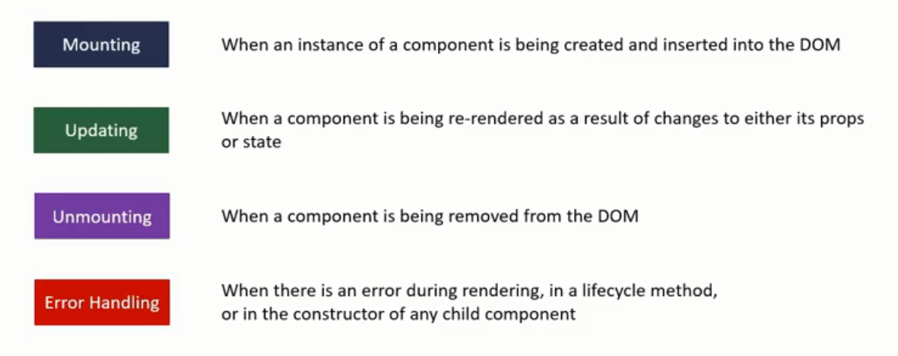
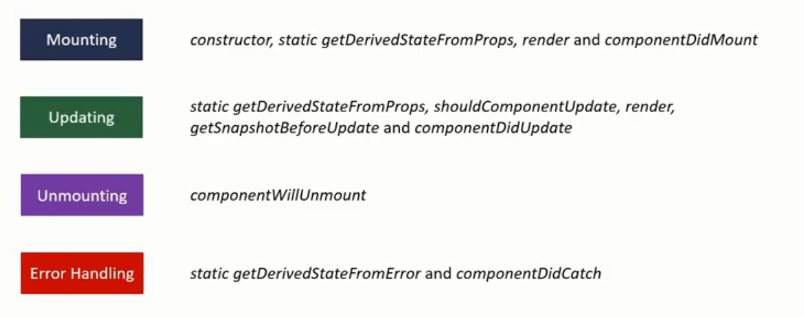
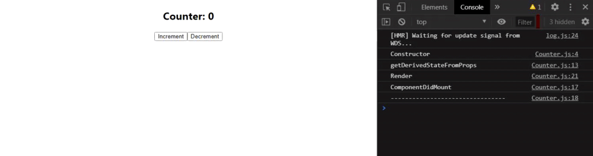

# Component Lifecycle Methods

**Resources:**  
1. [https://blog.pusher.com/beginners-guide-react-component-lifecycle/](https://blog.pusher.com/beginners-guide-react-component-lifecycle/).
2. [Youtube: ReactJS Tutorial Codevolution](https://www.youtube.com/watch?v=qnN_FuFNq2g&list=PLC3y8-rFHvwgg3vaYJgHGnModB54rxOk3&index=22)





## Mounting Lifecycle Methods
### 1. constructor(props)
- It is a special function that gets called whenever a new component is created.  
- **USE this for:**  
  - Initializing state
  - Binding event handlers  
- **DON'T use it for:**  
  - causing side effects like HTTP requests
- Call `super(props)` to call the base class constructor. We can use `this.props` only after we have called `super(props)`.
- Constructor is the only place where you're expected to change or set the state by directly overwriting `this.state`. In all other scenarios we have to use `this.setState()`

### 2.static getDerivedStateFromProps(props,state)
- rarely used lifecycle method
- used when the state of the component depends on changes in props over time and allows you to sync the state.
- Since its a static method, it does not have access to the `this` keyword.
- Since we cannot call `this.setState` in this method, we have to return an object that represents the new state of the component.
- **DO NOT** cause side effects.

### 3. render()
- It is the **only required** method in a Class Component.
- we read `this.props` and `this.state` and return JSX which describes the UI.
- It is a pure function. For the given props and state, it should always render the same UI.
- **DO NOT** change state or interact with DOM or make AJAX calls.
- After the parent render, the Children components lifecycle methods are executed.

### 4. componentDidMount
- called only once in the whole lifecycle of a given component.
- Invoked immediately after a component and all its children components have been rendered to the DOM.
- **Cause Side Effects** Ex: Interact with the DOM or perform any AJAX calls to load data.

An example demonstrating component mounting lifecycle methods:  

**`App.js`**
```javascript
import React, { Component } from 'react';
import './App.css';
import Counter from './Counter';

class App extends React.Component {
  render(){
    return (
      <div className="App">
        <Counter />
      </div>
    );
  }
  
}
export default App;
```
**`Counter.js`**
```javascript
import React, { Component } from 'react';

class Counter extends Component {
    constructor(props) {
        console.log("Constructor");
        super(props);
        this.state = { 
            counter: 0
         }
         this.increment = () => this.setState({counter: this.state.counter + 1});
         this.decrement = () => this.setState({counter: this.state.counter - 1});
    }
    static getDerivedStateFromProps(props, state){
        console.log('getDerivedStateFromProps')
        return null
    }
    componentDidMount(){
        console.log("ComponentDidMount")
        console.log("--------------------------------")
    }
    render() { 
        console.log("Render");
        return ( 
            <div>
                <div className="counter">
                    <h2>Counter: {this.state.counter}</h2>
                </div>
                <button onClick={this.increment}>Increment</button>
                <button onClick={this.decrement}>Decrement</button>
            </div>
         );
    }
}
export default Counter;
```


---------------------------------------------------------------------------------------------------------------------------------------
## Component Updating Lifecycle Methods
### 1. static getDerivedStateFromProps(props,state)
- This method is called every time a component is re-rendered.
- **DO:** Set the state
- **DON'T:** Cause side effects
- rarely used method in the updating phase

### 2. shouldComponentUpdate(nextProps, nextState)
- This method receives the updated props and state
- Dictates if the component should re-render or not.
- By default all class components will re-render whenever the props they receive or their state changes. This method can prevent that default behaviour by returning false.
- We can compare the existing props and state values with the next props and state values and return true or false to let React know whether the component should update or not.
- This method is basically for performance optimization.
- **DON'T:** Cause side effects or call the setState() method.
- rarely used lifecycle method.

### 3. render()
- same description as in mounting lifecycle methods

### 4. getSnapshotBeforeUpdate(prevProps, prevState)
- called right before the changes from the virtual DOM are to be reflected in the DOM.
- **DO:** Capture some information from the DOM. Example: Read the
