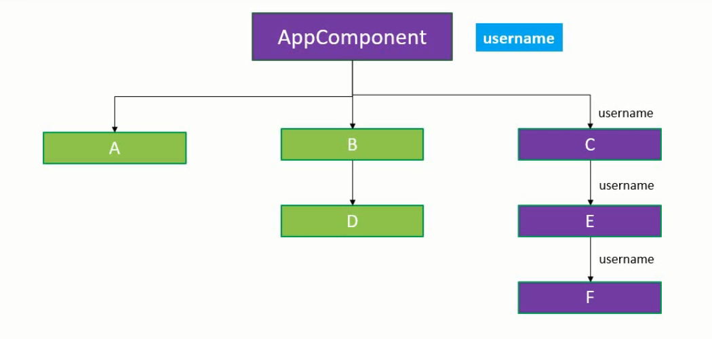

# React Context
- Context provides a way to pass the data through the component tree without having to pass down manually at every level.



- In our example, we will implement a User context which will enable a component at any level to read a prop that is passed at the top level.
- Our goal is to pass the username value from the App component and read that value in Component F using Context.

There are 3 steps to implement context:
 1. Create the context
 2. Provide a context value
 3. Consume the context value
 
#### userContext.js
```Javascript
import React from 'react';

const UserContext = React.createContext()

const UserProvider = UserContext.Provider
const UserConsumer = UserContext.Consumer

export {UserProvider, UserConsumer};
```

#### App.js
```Javascript
import React from 'react';
import './App.css';
import ComponentC from './components/ComponentC';
import {UserProvider} from './components/userContext'

function App() {
  return (
    <div className="App">
    <UserProvider value="Evan">
      <ComponentC />
    </UserProvider>
    </div>
  );
}

export default App;
```

#### ComponentC.js
```Javascript
import React, { Component } from 'react';
import ComponentE from './ComponentE';

class ComponentC extends Component {
    render() { 
        return <ComponentE />;
    }
}
 
export default ComponentC;
```

#### ComponentE.js
```Javascript
import React, { Component } from 'react';
import ComponentF from './ComponentF';

class ComponentE extends Component {
    render() { 
        return <ComponentF />;
    }
}
 
export default ComponentE;
```

#### ComponentF.js
```Javascript
import React, { Component } from 'react';
import {UserConsumer}  from './userContext'

class ComponentF extends Component {
    render() { 
        return (
            <UserConsumer>
                {
                    (username) => {
                        return <h2>Hello {username}</h2>
                    }
                }            
            </UserConsumer>
        );
    }
}
 
export default ComponentF;
```

- If we check the browser, you should be able to see the text Hello Evan displayed from component F. We have successfully used context to provide a value to a deeply nested component without having to pass that value as a prop through every intermediate component.

#### STEPS EXPLAINED:
1. ***Create the context:*** (in userContext.js) using the React.createContext method. Be sure to export the provider and consumer components as well.
2. ***Provide a context value:*** (in App.js) At the top level, include the provider component and provide a value using the value attribute. This value can now be consumed by any of the descendant components.
3. ***Consume the context value:*** (in ComponentF.js) In the component where username is required, use the Consumer Component and pass in a function as its child. The function receives the context value as its parameter which can then be used to return the desired JSX. You can choose to just display it or use it for some rendering logic.

--------------------------------------------------------------------------------------------------------------------------------------------------------------------------------

## Setting Default Value for Context

- We can set a default value to our context and the default value is set while creating the context.
- It is passed as an argument to the createContext method.
- The default value will only be used if a component does not have a matching Provider above it in the component tree.
#### In userContext.js
```Javascript
const UserContext = React.createContext('SpaceX')
```

#### In App.js 
```Javascript
return (
    <div className="App">
    //comment out the UserProvider
    {/* <UserProvider value="Evan"> */}
      <ComponentC />
    {/* </UserProvider> */}
    </div>
  );
```
- You will be able to see the message 'Hello SpaceX' in the browser.

## The contextType Property

- There is another way to consume context value instead of using the Consumer component using the contextType property on a class.
- Lets see how that works by consuming the userContext value in ComponentE 
- First step, in userContext.js, we need to export the userContext itself.
```Javascript
    export default UserContext;
```
- Second step, assign the userContext to the contextType property on the class. 
```Javascript
import React, { Component } from 'react';
import ComponentF from './ComponentF';
import UserContext from './userContext'

class ComponentE extends Component {
    render() { 
        return (
            <div>
                Component E context {this.context}
                <ComponentF />
            </div>
        );
    }
}
ComponentE.contextType = UserContext

export default ComponentE;
```
- Now, ComponentE is also able to use the context and render the username.
- If your application supports the public class field syntax, you can replace `componentE.contextType` with `static contextType` and application still works the same.
```Javascript
class ComponentE extends Component {
    static contextType = UserContext
    render() { 
        return (
            <div>
                Component E context {this.context}
                <ComponentF />
            </div>
        );
    }
}
```
There are two limitations to using contextType:
1. It only works with class components. 
2. You can only subscribe to a single context using contextType 

## Consuming Multiple Contexts
- We have two contexts ThemeContext and UserContext
- ThemeContext.Consumer accepts a function as a child passing in the theme value.
- Within the function body, we have another function as a child which provides the UserContext value.
- Both of them are then passed as props to a component.
```Javascript
function Content(){
    return (
        <ThemeContext.Consumer>
        {theme => (
            <UserContext.Consumer>
            {user => (
                <ProfilePage user={user} theme={theme} />
            )}
            </UserContext.Consumer>
        )}
        </ThemeContext.Consumer>
    );
}
```
