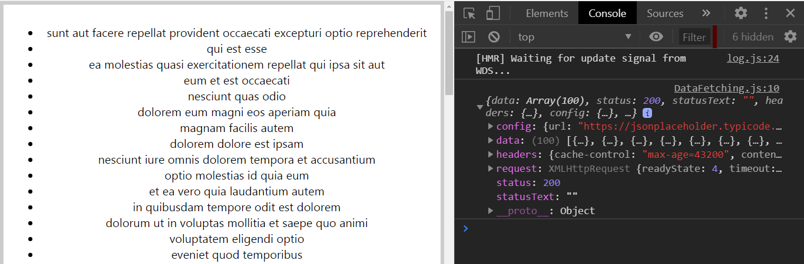
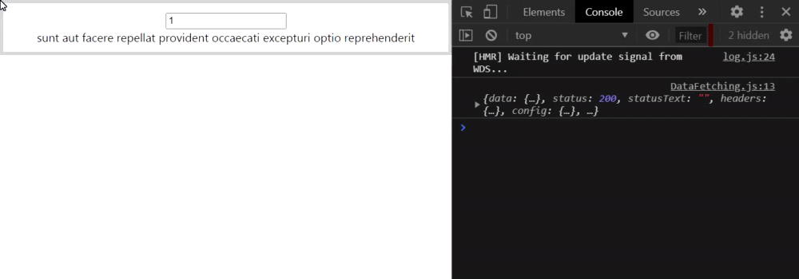
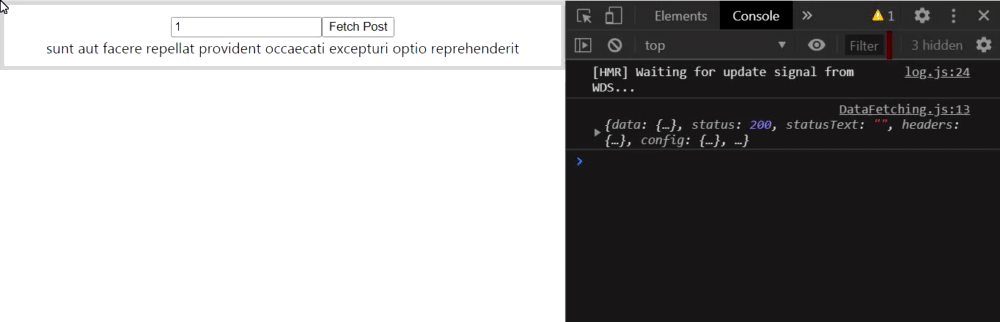

# Fetching Data with useEffect

In the example below, we will be fetching data from an endpoint using useEffect.
> Extra information: In the future, a new feature called suspense would be in charge for data fetching.

#### 1. Install the **Axios package**  
```npm install axios```
- You can use Fetch API, but I prefer Axios for data fetching.
- you can check in package.json, axios package is now added in the dependencies.

#### 2. Create a component DataFetching.js inside the components folder.

#### 3. Import React, useState, useEffect, and axios
```
import React, {useState, useeffect} from 'react';
import axios from 'axios'
```

#### 4. Fetch the data. 
- For that we'll be using JSON placeholder. In the browser, navigate to [https://jsonplaceholder.typicode.com/](https://jsonplaceholder.typicode.com/)
- Scroll down to the resources section. The first end point /posts gives us access to a hundred posts. It gives us JSON data. 
- The URL 'https://jsonplaceholder.typicode.com/posts' is the URL we need to make a get request to in order to fetch this data,
- Lets make appropriate changes in DataFetching.js to fetch this array of posts.

#### DataFetching.js
```Javascript
import React, {useState, useEffect} from 'react';
import axios from 'axios'

const DataFetching = () => {
    const [posts, setPosts] = useState([])

    useEffect(() => {
        axios.get('https://jsonplaceholder.typicode.com/posts')
            .then(res => {
                console.log(res)
                setPosts(res.data)
            })
            .catch(err => {
                console.log(err)
            })
    }, [])
    return ( 
        <div>
            <ul>
                { 
                    posts.map(post => <li key={post.id}>{post.title}</li>)
                }
            </ul>
        </div>
     );
}
 
export default DataFetching;
```
#### App.js
```Javascript
import React from 'react';
import './App.css';
import DataFetching from './components/DataFetching'

function App() {
  return (
    <div className="App">
      <DataFetching />
    </div>
  );
}

export default App;
```
- The posts titles are rendered in the UI but if you take a look at the console, we have had an infinite loop of data fetching. 
- We want the data to be fetched only once on componentDidMount.
- For that, we need to specify an empty dependency list to the useEffect

So, the final output after adding the empty dependency list looks like this:



---------------------------------------------------------------------------------------------------------------------------------------------------------------------------------
## Fetching individual posts
- Now we'll learn how to fetch individual posts by passing in the post id to the get request.
- In the Routes section of the JSON Placeholder website, we have `/posts` which returns 100 posts and we also have `/posts/1` which returns a single post with post ID = 1.
- So in order to retrieve an individual post by post ID, we just have to append /ID to the current URL we're using in our effect hook.
- We'll create an input element that will accept a post ID from the user.
- we'll need to set the value of the input element and listen to the onChange event to assign the value back to the input element.

#### DataFetching.js
```Javascript
const DataFetching = () => {
    // const [posts, setPosts] = useState([]) 
    //1. change posts to post and set it to empty object instead of empty array
    const [post, setPost] = useState({})
    const [id, setId] = useState(1)

    useEffect(() => {
        axios.get(`https://jsonplaceholder.typicode.com/posts/${id}`) //2. change the url to append the post id
            .then(res => {
                console.log(res)
                setPost(res.data) //3. change setPosts to setPost
            })
            .catch(err => {
                console.log(err)
            })
    }, [id]) //4. Add id to the dependency list
    return ( 
        <div>
            { /* 5. Add an input button */ }
            <input type="text" value={id} onChange={e => setId(e.target.value)}/>
            <div>{post.title}</div>
            { /* 6. comment out the code for displating posts data */ }
            {/* <ul>
                { 
                    posts.map(post => <li key={post.id}>{post.title}</li>)
                }
            </ul> */}
        </div>
     );
}
```
 

So, we are successfully able to  fetch an individual post by passing in the ID entered by the user. But there are some problems.

**PROBLEMS:**  
- On every key pressed, the effect is triggered which executes another data fetching request. It would be better if we trigger the request on a button click.
- When we type in the input field, we see the title, but when we press backspace and remove the ID, we see the API returns all the 100 posts as an array.

---------------------------------------------------------------------------------------------------------------------------------------------------------------------------------

## Trigger effect on a button click
Here we will fetch data on button click rather than onChange event which will solve the problems stated above.

 

#### DataFetching.js
```Javascript
import React, {useState, useEffect} from 'react';
import axios from 'axios'

const DataFetching = () => {
    const [post, setPost] = useState({})
    const [id, setId] = useState(1)
    const [idFromButtonClick, setIdFromButtonClick] = useState(1)

    useEffect(() => {
        axios
            .get(`https://jsonplaceholder.typicode.com/posts/${id}`)
            .then(res => {
                console.log(res)
                setPost(res.data)
            })
            .catch(err => {
                console.log(err)
            })
    }, [idFromButtonClick])

    const handleClick = () => {
        setIdFromButtonClick(id)
    }
    return ( 
        <div>
            <input type="text" value={id} onChange={e => setId(e.target.value)}/>
            <button onClick={handleClick}>Fetch Post</button>
            <div>{post.title}</div>
        </div>
     );
}
 
export default DataFetching;
```

