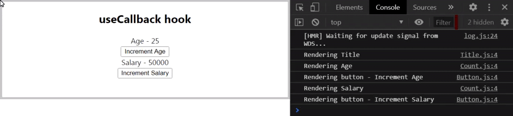
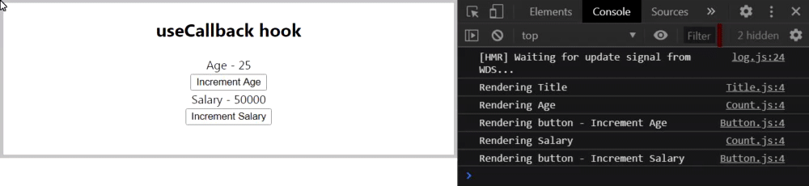

# useCallback hook

- We use useCallback hook for performance optimization. Its better to understand with the help of an example.
- We have a ParentComponent which is a container for other components. It has total 5 components in which Count and Button are re-used with different props. (check code below)
- If we open the browser, we can see 5 console log statements one for each component rendered on the screen.
- Now, if we click on the Increment Age(or Increment Salary) button, the age count increases and if you check the logs, every component is re-rendered. 
- To improve performance, we must restrict re-renders to only components that need to re-render. 
- If we increment the age, only the count component for Age and the Button component for increment Age should re-render. The other three components don't have to re-render.
- Similarly, if we increment the salary, title and age components should not re-render.
- So, we optimize this using ***React.memo***. 
- React.memo is a HOC that will prevent a functional component from being re-rendered if its props or state do not change.
> NOTE: React.memo has nothing to do with hooks. Its a React feature since React 16.6.

- While exporting the three components(Title, Count and Button), wrap the components with React.memo. So, now our components will re-render only if there is a change in its props or state.
- Now, if we re-load the page, and check the console, there are fewer logs, but its still not right.
- When we increment age, the button to increment salary is also being re-rendered and if we click on Increment salary, then the button to increment age is also being re-rendered.
- This happens because a new incrementSalary(or incrementAge) function is created each time, the parent component re-renders and when dealing with functions we always have to consider reference equality.
- Even though two functions have the exact same behaviour, it does not mean they are equal to each other. So, ***the function before the re-render is different to the function after the re-render***. And since the function is a prop in the <Button> component, React.memo sees that the prop has changed and will not prevent the re-render.



- So, how do we fix this? How do we tell React that there is no need to create a new incrementSalary function when we update the age? The answer is useCallback hook

#### App.js
```Javascript
import React from 'react';
import './App.css';
import ParentComponent from './components/ParentComponent';

function App() {
  return (
    <div className="App">
      <ParentComponent />
    </div>
  );
}

export default App;
```

#### ParentComponent.js
```Javascript
import React, { useState } from 'react';
import Count from './Count';
import Button from './Button';
import Title from './Title';

const ParentComponent = () => {
    const [age, setAge] = useState(25)
    const [salary, setSalary] = useState(50000)

    const incrementAge = () => {
        setAge(age + 1)
    }

    const incrementSalary = () => {
        setSalary(salary + 10000)
    }

    return ( 
        <div>
            <Title />
            <Count text="Age" count={age} />
            <Button handleClick={incrementAge}>Increment Age</Button>
            <Count text="Salary" count={salary} />
            <Button handleClick={incrementSalary}>Increment Salary</Button>
        </div>
     );
}
 
export default ParentComponent;
```

#### Title.js
```Javascript
import React from 'react';

const Title = () => {
    console.log('Rendering Title')
    return ( 
        <h2>
            useCallback hook
        </h2>
     );
}
 
export default React.memo(Title);
```

#### Count.js
```Javascript
import React from 'react';

const Count = ({text, count}) => {
    console.log(`Rendering ${text}`)
    return ( 
        <div>
            {text} - {count}
        </div>
     );
}
 
export default React.memo(Count);
```

#### Button.js
```Javascript
import React from 'react';

const Button = ({handleClick, children}) => {
    console.log(`Rendering button - ${children}`)
    return ( 
        <button onClick={handleClick}>
            {children}
        </button>
     );
}
 
export default React.memo(Button);
```

### What is useCallback?
useCallback is a hook that will return a memoized version of the callback function that only changes if one of the dependencies has changed.
- If we relate to our example, it means is that the useCallback hook will cache the incrementSalary function and return that if salary is not incremented. If the salary does increment i.e. if the dependency has changed, only then a new function will be returned. 

### Why do we need useCallback?
It is useful when passing callbacks to optimized child components that rely on reference equality to prevent unnecessary renders.
- callbacks like incrementAge and incrementSalary
- here optimized child components means child components we have optimized with React.memo to avoid unnecessary re-renders.

### How to use the useCallback hook?
1. Import it from React
2. call useCallback which accepts a callback function as its first parameter and an array of dependencies as its second parameter.



#### ParentComponent.js
```Javascript
import React, { useState, useCallback } from 'react';
import Count from './Count';
import Button from './Button';
import Title from './Title';

const ParentComponent = () => {
    const [age, setAge] = useState(25)
    const [salary, setSalary] = useState(50000)

    const incrementAge = useCallback(() => {
        setAge(age + 1)
    }, [age])

    const incrementSalary = useCallback(() => {
        setSalary(salary + 10000)
    }, [salary])

    return ( 
        <div>
            <Title />
            <Count text="Age" count={age} />
            <Button handleClick={incrementAge}>Increment Age</Button>
            <Count text="Salary" count={salary} />
            <Button handleClick={incrementSalary}>Increment Salary</Button>
        </div>
     );
}
 
export default ParentComponent;
```
- now in both the cases(incrementAge and incrementSalary), we return a cached function which is passed as a prop to the child components.
