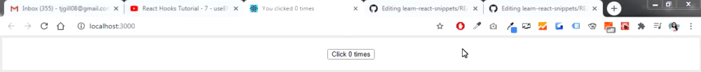
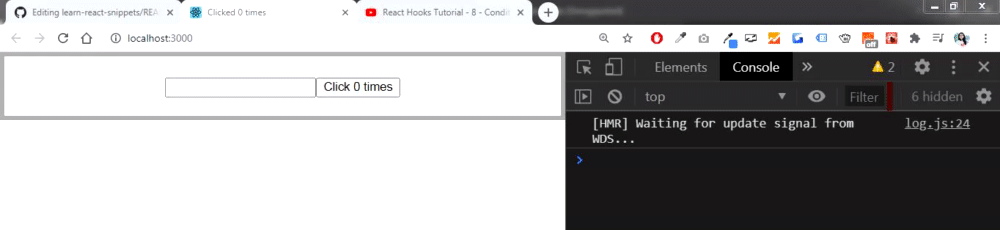
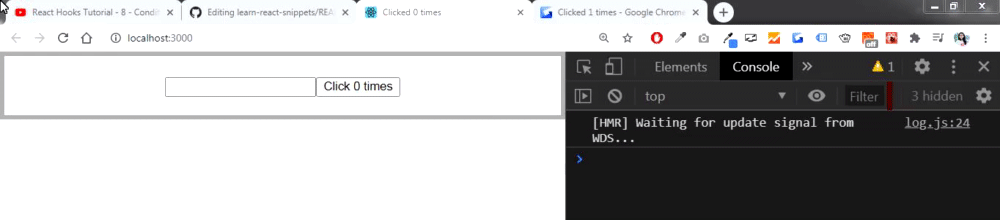
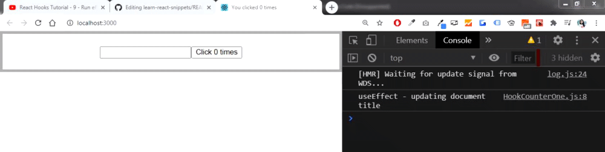
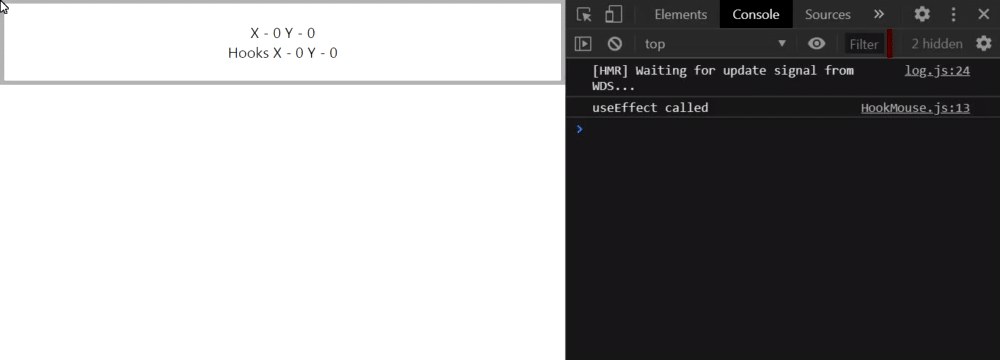
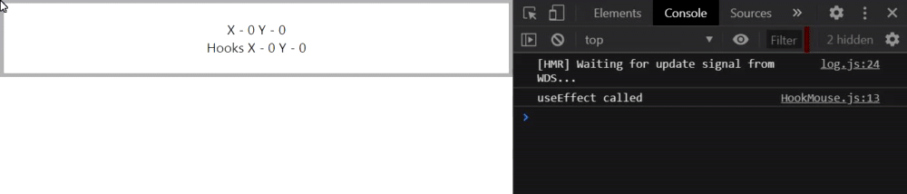
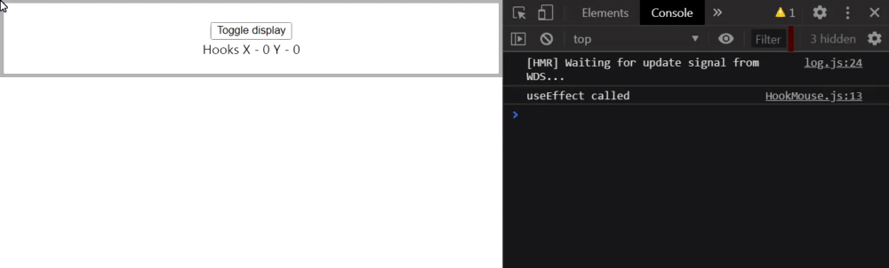
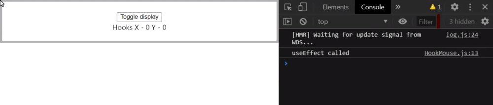
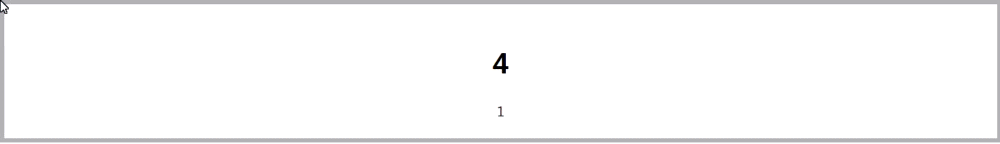

# useEffect Hook
- The useEffect hook lets you perform side effects in functional components.
- It is a close replacement for **componentDidMount**, **componentDidUpdate**, and **componentWillUnmount**.
- The useEffect hook is called at the initial render and ***after every single render***.

### Class component example using setState
#### App.js
```javascript
import React from 'react';
import './App.css';
import ClassCounterOne from './components/ClassCounterOne';
import HookCounterOne from './components/HookCounterOne';

function App() {
  return (
    <div className="App">
      <ClassCounterOne />
      <HookCounterOne />
    </div>
  );
}

export default App;
```
#### ClassCounterOne.js
```javascript
import React, { Component } from 'react';

class ClassCounterOne extends Component {
    constructor(props) {
        super(props);
        this.state = { 
            count: 0
         }
    }
    componentDidMount() {
        document.title = `Clicked ${this.state.count} times`
    }
    componentDidUpdate(prevProps, prevState) {
        document.title = `Clicked ${this.state.count} times`
    }
    render() { 
        return ( 
            <div>
                <button onClick={() => this.setState({count: this.state.count + 1})}>
                    Click {this.state.count} times
                </button>
            </div>
         );
    }
}
 
export default ClassCounterOne;
```
### Functional Component using React useEffect Hook(Implementing the same logic)


#### HookCounterOne.js
```javascript
import React, {useState, useEffect} from 'react';

const HookCounterOne = () => {
    const [count, setCount] = useState(0)

    useEffect(() => {
        document.title = `You clicked ${count} times`
    })
    return ( 
        <div>
            <button onClick={() => setCount(count + 1)}>
                Click {count} times
            </button>
        </div>
     );
}
 
export default HookCounterOne;
```
----------------------------------------------------------------------------------------------------------------------------------------
## Conditionally run effects
- As we know, useEffect hook is called after every single render. In some cases, it might cause performance issues.
- So we need a way to conditionally run an effect from our functional component.
- To understand, lets make some changes to the ClassCounterOne.js 

### Class component implementation
#### ClassCounterOne.js
```Javascript
class ClassCounterOne extends Component {
    constructor(props) {
        super(props);
        this.state = { 
            count: 0,
            name: ''
         }
    }
    componentDidMount() {
        document.title = `Clicked ${this.state.count} times`
    }
    componentDidUpdate(prevProps, prevState) {
        console.log('Updating document title');
        document.title = `Clicked ${this.state.count} times`
    }
    render() { 
        return ( 
            <div> 
                <input type="text" 
                    value={this.state.name} 
                    onChange={e => {
                        this.setState({name: e.target.value})
                    }} 
                />
                <button onClick={() => this.setState({count: this.state.count + 1})}>
                    Click {this.state.count} times
                </button>
            </div>
         );
    }
}
```


- When we click on the button, we can see the log statement and the document title updates.
- But when we start typing in the text box we still get the log statement 'Updating document title' which is basically setting the document title to the same string 7 times which is unnecessary as the count value is still 1. 
- To optimize this, we can compare the count value before and after the update, and if at all the count value changed, we then conditionally update the title. There is no need to update the title if its not even changing between the renders.

#### ClassCounterOne.js
```javascript
componentDidUpdate(prevProps, prevState) {
    //conditionally updating the title only when the appropriate variable(count) changes
    if(prevState.count !== this.state.count){
        console.log('Updating document title');
    }
    document.title = `Clicked ${this.state.count} times`
}
```


### Functional component implementation(useEffect) 
- In class components, we added a check to compare the previous state with the current state and only update if there is a difference to conditionally run useEffect only when the count value changes.
- In useEffect, for conditionally executing an effect, we pass in a second parameter, called the ***dependency array***.
- Within this array, we need to specify either props or state that we need to watch for only if those props and state specified in this array were to change the effect would be executed.
- In our example, we need the effect to be executed only when the count value changes.


#### HookCounterOne.js
```javascript
import React, {useState, useEffect} from 'react';

const HookCounterOne = () => {
    const [count, setCount] = useState(0)
    const [name, setName] = useState('')

    useEffect(() => {
        console.log('useEffect - updating document title');
        document.title = `You clicked ${count} times`
    }, [count])
    return ( 
        <div>
            <input type="text" value={name} onChange={e => setName(e.target.value)} />
            <button onClick={() => setCount(count + 1)}>
                Click {count} times
            </button>
        </div>
     );
}
 
export default HookCounterOne;
```
----------------------------------------------------------------------------------------------------------------------------------------
## Run effects only once (mimic componentDidMount)
- How to run effect only once or how to mimic class component componentDidMount with useEffect and functional component.

### Class component implementation
#### ClassMouse.js
```javascript
import React, { Component } from 'react';

class ClassMouse extends Component {
    constructor(props) {
        super(props);
        //x and y coordinates position of mouse pointer
        this.state = { 
            x: 0,
            y: 0
         }
    }
    logMousePosition = e => {
        this.setState({x: e.clientX, y: e.clientY})
    }
    componentDidMount(){
        window.addEventListener('mousemove', this.logMousePosition)
    }
    render() { 
        return ( 
            <div>
                X - {this.state.x} Y - {this.state.y}
            </div>
         );
    }
}
 
export default ClassMouse;
```

### Functional component implementation
#### HookMouse.js
```javascript
import React, {useState, useEffect} from 'react';

const HookMouse = () => {
    const [x, setX] = useState(0)
    const [y, setY] = useState(0)

    const logMousePosition = e => {
        console.log('Mouse event')
        setX(e.clientX)
        setY(e.clientY)
    }
    useEffect(() => {
        console.log('useEffect called');
        window.addEventListener('mousemove', logMousePosition)
    })
    return ( 
        <div>
            Hooks X - {x} Y - {y}
        </div>
     );
}
 
export default HookMouse;
```


- When we run the code above, the useEffect is called from the initial render and when we move the mouse around, the effect is called every time the component re-renders.
- The effect is called after every render unless you specify the dependency array.
- For our example, we don't want the effect to depend on anything(like it depend on count in the previous example).
- We want it to be called once on initial render only. We do that by specifying an ***empty array as the second parameter to useEffect***.
- We are basically telling React that ***this particular effect does not depend on any props or state***.
- So. useEffect is only called on the initial render, not on re-renders. That's how we ***mimic componentDidMount***.
```javascript
useEffect(() => {
    console.log('useEffect called');
    window.addEventListener('mousemove', logMousePosition)
}, []) //empty dependency array
```

----------------------------------------------------------------------------------------------------------------------------------------

## useEffect with cleanup (mimic componentWillUnmount)
- In this example, we will create a container component for the `HookMouse.js` which we implemented in the last section.
- We will create a button that will toggle the component's visibility.
- The cleanup code can be cancelling subscriptions, timers or removing event handlers.

```Javascript
import React, { useState } from 'react';
import HookMouse from './HookMouse';

const MouseContainer = () => {
    const [display, setDisplay] = useState(true)
    return ( 
        <div>
            <button onClick={() => setDisplay(!display)}>Toggle display</button>
            {display && <HookMouse />}
        </div>
     );
}
 
export default MouseContainer;
```
If we now call MouseContainer component in the App.js, we will se the output as shown below

```Javascript
import MouseContainer from './components/MouseContainer';
function App() {
  return (
    <div className="App">
      <MouseContainer />
    </div>
  );
}
```



- When we click the Toggle Display button, it unmounts the HookMouse component from the DOM.
- **PROBLEM:** When we move the mouse around, when the component is unmounted, we see a warning in the console and the mouse event is still being logged. So, ***even though the component has been removed, the event listener which belongs to theat component is still listening and executing***. It indicates a ***memory leak*** in your application as per the warning.
- **SOLUTION:** ***When you unmount a component , make sure you cancel all your subscriptions and listeners i.e. run cleanup code***.

### Cleanup in Class component
To unmount the component from the DOM, we use `componentWillUnmount` lifecycle method in class components and we run the cleanup code here.
#### ClassMouse.js
```Javascript
//cleanup code in class components
componentWillUnmount() {
    window.removeEventListener('mousemove', this.logMousePosition)
}
```
### Cleanup in Functional component 
- The function that is passed to useEffect can return a function which will be executed when the component will unmount.
- So whatever you return is basically your cleanup function.
- So, from this arrow function passed to useEffect, we return another cleanup function



#### HookMouse.js
```Javascript
useEffect(() => {
    console.log('useEffect called');
    window.addEventListener('mousemove', logMousePosition)
    
    //cleanup code
    return () => {
        console.log('useEffect - component unmount')
        window.removeEventListener('mousemove', logMousePosition)
    }
}, [])
```
----------------------------------------------------------------------------------------------------------------------------------------

## useEffect with incorrect dependency
- In this example, we're going to create a simple counter but this time its going to automatically increment every second.
- Always think before specifying an empty dependency array.

### Class Component Implemmentation
#### IntervalClassCounter.js
```Javascript
import React, { Component } from 'react';

class IntervalClassCounter extends Component {
    constructor(props) {
        super(props);
        this.state = { 
            count: 0
         }
    }
    componentDidMount() {
        //place to create timers
        this.interval = setInterval(this.tick, 1000)
    }
    componentWillUnmount() {
        clearInterval(this.interval)
    }
    tick = () => {
        this.setState({
            count: this.state.count + 1
        })
    }
    render() { 
        return <h1>{this.state.count}</h1>;
    }
}
 
export default IntervalClassCounter;
```

### Functional Component Implemmentation
#### IntervalHookCounter.js
```Javascript
import React, { useState, useEffect } from 'react';
const IntervalHookCounter = () => {
    const [count, setCount] = useState(0)

    useEffect(() => {
        const interval = setInterval(tick, 1000)

        return () => {
            clearInterval(interval)
        }
    }, []) // we pass an empty dependency array as it is componentDidMount equivalent of class component

    const tick = () => {
        setCount(count + 1)
    }

    return ( 
        <div>
            {count}
        </div> 
    );
}
 
export default IntervalHookCounter;
```
#### App.js
```Javascript
import IntervalClassCounter from './components/IntervalClassCounter';
import IntervalHookCounter from './components/IntervalHookCounter';

function App() {
  return (
    <div className="App">
      <IntervalClassCounter />
      <IntervalHookCounter />
    </div>
  );
}
```
**PROBLEM:** When we run the code, the Class Counter works as expected, but the Hook Counter only display value of 1 and does not increment it every second.



- In our mind, the problem statement is simple. Create an interval once and destroy it once. So we created in componentDidMount and destroyed in componentWillUnmount.
- I our Hook counter, we have just translated the class counter code, we have passed an empty dependency list to useEffect so that the timer is set only once and return function to destroy the timer that we created. Why then our counter doesn't work as expected?
- The problem here is our mental model. Our mindset was to simply replicate componentDidMount. However, by specifying an empty array, we have basically told react to ignore watching for changes in the count variable.
- In initial render, count value is 0, then setCount sets it to 1 and that is rendered in the browser. After that React does not watch for changes in the count value as we have passed an empty dependency array and only 1 is rendered through the different re-render cycles.
> If you think dependency array is a way to specify when you want to rerun the effect, you're going to run into problems. Instead ***dependency array should be thought of as a way to let React know about everything that the effect must watch for changes***.

**SOLUTION 1:** Add count as a dependency
```Javascript
useEffect(() => {
    const interval = setInterval(tick, 1000)

    return () => {
        clearInterval(interval)
    }
}, [count]) 
```
**SOLUTION 2:** (Without the dependency list) In the tick function, we use the second form(functional) of setCount
- Now, since setCount keeps track of the previous count value, we dont have to specify count as a dependency for the useEffect.
```Javascript
useEffect(() => {
    const interval = setInterval(tick, 1000)

    return () => {
        clearInterval(interval)
    }
})

const tick = () => {
    setCount(prevCount => prevCount + 1) //second form of setCount
}
```
----------------------------------------------------------------------------------------------------------------------------------------
## Tips for using effects
### TIP NO. 1:
- Sometimes you might want to call a function within useEffect. It's very easy to forget that some prop is a dependency.
- So, its recommended that whenever you need to call a function within useEffect, just define the function inside useEffect.  

#### Not recommended
```Javascript
function doSomething(){
    console.log(someProp)
}
useEffect(() => {
    doSomething()
    const interval = setInterval(tick, 1000)

    return () => {
        clearInterval(interval)
    }
})
```

#### Recommended way of calling function:
- This way when you read through the effect, you're much more likely to see that you have a prop which has to be specified as a dependency.
```Javascript
useEffect(() => {
    function doSomething(){
        console.log(someProp)
    }
    doSomething()
    const interval = setInterval(tick, 1000)

    return () => {
        clearInterval(interval)
    }
}, [someProp])
```

